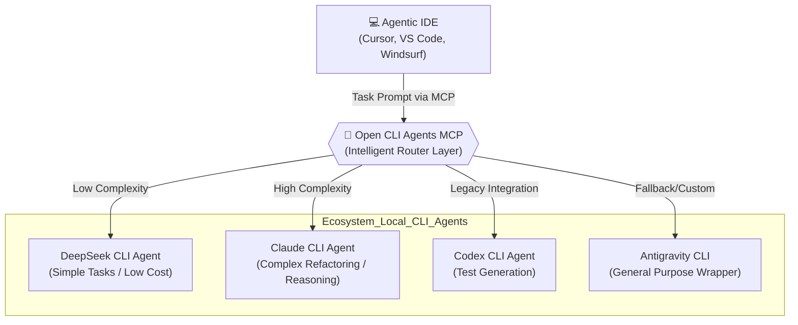

# 🌌 Open CLI Agents MCP — The Tooling Sovereignty Ecosystem

!!! abstract "Executive Summary"
    **Open CLI Agents MCP** is not just an isolated tool, but an **continuously expanding ecosystem** of developer infrastructure (DevTools). Its main goal is to break the *vendor lock-in* of modern agentic IDEs (like Cursor and Windsurf). Through a suite of *Model Context Protocol (MCP)* servers, the project exposes multiple CLI-based programming agents to a single agentic IDE (orchestrator), guaranteeing the developer total freedom of choice, self-managed API quotas, and true "Tooling Sovereignty".

    Instead of being dependent on closed subscriptions and *fast request* limits imposed by IDEs, the developer uses the orchestrator agent present in the IDE (which can be configured with a much cheaper and faster model) to focus purely on **planning and architecture**. This orchestrator, in turn, triggers the MCP server to relay execution *prompts* to the underlying CLI agentic tools installed on their machine. This guarantees secure quota isolation, lowers costs, and avoids productivity stranglehold when the main provider's limits are reached. Currently only **antigravity-cli-mcp** makes up the ecosystem, but when more tools are available it will be possible to delegate tasks to different CLI programming agents in parallel (asynchronous mode).

---

## 🚀 The Genesis: `antigravity-cli-mcp`

The pioneering project that inaugurated this ecosystem is **`antigravity-cli-mcp`**. It acts as the first abstraction layer (Proxy/Wrapper) built to prove the Tooling Sovereignty concept.

Instead of being dependent on closed subscriptions and *fast request* limits imposed by IDEs, the architecture proposes an intelligent inversion of control. The developer uses the IDE's native orchestrator agent (which can be configured with a much cheaper and faster model) to focus purely on **planning and architecture**. This orchestrator, in turn, triggers the MCP server to relay execution *prompts* to the underlying CLI agentic tools installed on the machine. This guarantees secure quota isolation, lowers costs, and avoids productivity stranglehold when the main provider's limits are reached.

### 🛠️ Core Features and Tools
The MCP server was designed to be "stateless" and act as an efficient communication bus, exposing the following fundamental *tools* for the IDE:

* **`execute_agentic_task`:** Receives the action plan formulated by the IDE and starts autonomous execution in the underlying CLI with the appropriate prompt.
* **`get_execution_logs`:** Captures and returns the CLI output stream (stdout/stderr) in real-time, allowing the IDE to follow progress, audit changes, and react to any compilation or test failures.
* **`check_cli_status`:** Validates tool availability on the host, API keys integrity, and execution paths before starting expensive async operations.

!!! success "Security Posture (Zero-Trust Model)"
    Allowing an AI in the IDE to command a second AI in the terminal requires extreme security rigor. As in all my portfolio, `antigravity-cli-mcp` implements native architectural defenses:

    * **Directory Sandboxing:** The server implements strict *Path Traversal* blocks. The underlying CLI is forced to operate exclusively within the active project *Workspace*, preventing it from reading or modifying vital host operating system files.
    * **Shell Injection Prevention:** Arguments relayed from the IDE to the CLI are never concatenated as raw *strings* in a terminal. They are executed via secure subprocess delegation, neutralizing malicious injections or dangerous command hallucinations.
    * **FastMCP/Pydantic Sanitization:** All inter-process communication is rigidly validated at runtime through data contracts (schemas).

---

## 📈 Ecosystem Expansion and Growth

`antigravity-cli-mcp` is just the foundational block. The **Open CLI Agents** ecosystem was architected to scale horizontally. The active development *roadmap* includes the construction and integration of modular MCP servers dedicated to the best AI CLIs on the market:

* 🟢 **Claude CLI Integration** — Specialized in architectural reasoning and complex refactoring of large codebases.
* 🔵 **DeepSeek Coder CLI** — Targeted for high mathematical efficiency tasks and strong cost-benefit ratio.
* ⚫ **Codex / OpenAI CLI** — Focused on legacy integrations and ultra-fast routine *snippets* generation.

---

## 🔮 Future Vision: The Intelligent Task Router

As the ecosystem grows and multiple servers/agents become available, the next major architectural evolution will be the implementation of a **Task-Based LLM Router**.

Instead of the developer manually selecting which agent to trigger, the *Open CLI Agents* orchestration layer will perform dynamic routing based on task semantics:

### 🧠 Intelligent Routing Pillars

1. **Complexity Heuristics:** Instruction analysis to direct only critical tasks (e.g., *System Design*) to more expensive models (high *reasoning*).
2. **Financial Optimization:** Automatic routing of repetitive workloads and *boilerplates* to local models or low-cost APIs.
3. **Rate Limit Fallback:** Fluid and imperceptible switching between providers if an API reaches the HTTP status `429 Too Many Requests`, guaranteeing continuous *uptime* for the developer.

---

