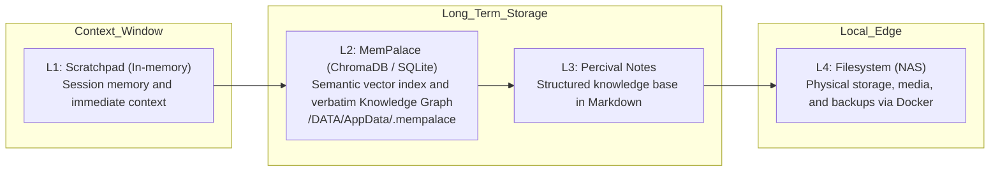
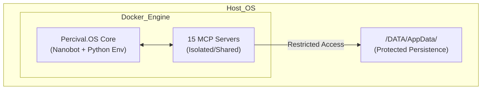
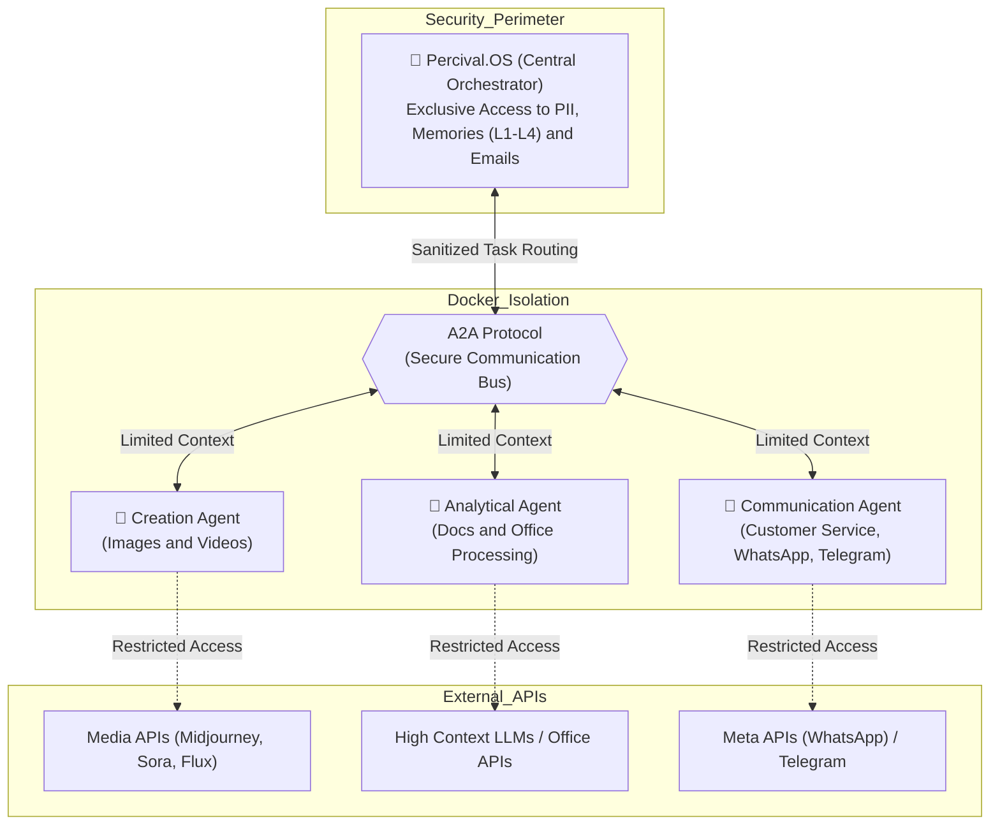

# 🛡️ percival.OS — Personal Agentic AI Ecosystem

!!! abstract "Executive Summary"
    Percival.OS is a personal agentic operating system (Personal AI Agent Operating System), designed for professionals with high workloads who need a secure, reliable, and locally executed AI assistant. The central mission of the project is not to replace people, but to empower them, automating repetitive tasks and providing 24/7 analytical support under rigorous security standards.

    The project is being built based on a modified version of the Nanobot AI agent and a long-term memory system implemented using the MemPalace project. In addition to this core, the project also features a series of MCP servers created to interact efficiently and extremely securely with the AI agent, thus expanding its capabilities with security and reliability. In addition to MCP servers, the project also features a series of Skills created as an orchestration layer for the agent's capabilities, coordinating multiple MCP servers in complex workflows.
---

## 🏗️ Philosophy and Core Architecture

The system was architected with the premise that **the computer belongs to the AI agent***, while maintaining full human access for configuration, adjustments, and auditability.

The operating system base is **Nanobot**, an extremely lightweight and modular open source agent, chosen specifically for its flexibility and native integration with the **Model Context Protocol (MCP)** as the central tool.

The project was thought from step zero, with a modular and extensible approach that allows continuous system evolution. Additionally, Percival.OS is being built optimized to run in Docker containers.

---

### The Security Stack (Security-First)
Bringing my 15 years of experience in quality assurance and traceability from Industrial Biotechnology, Percival.OS was built on a non-negotiable foundation of *Data Sovereignty* and resilience:
* **Data Validation:** Intensive use of `Pydantic` and the `FastMCP` framework to ensure strict security contracts.
* **Threat Prevention:** Implementation of *Prompt Injection Shields*, *Path Traversal* blocking, and Shell injection prevention, ensuring the agent operates autonomously without compromising the host.
* **Strict Data Isolation:** Use of *Untrusted Data Envelopes* for handling external data.

---

## 🧠 Multi-Layer Memory System

One of the greatest technical challenges in Agentic AI is managing LLM context windows. To solve this, I designed a 4-layer memory architecture (L1 to L4).

To ensure architectural clarity and rigorous long-term data preservation, the system's directory tree was reviewed and structured to isolate permanent memory storage in a specific high-security path (`/DATA/AppData/.mempalace`).

The main component of this topology is **MemPalace (L2)**, an MCP Server that provides hybrid *retrieval* with precision benchmarks above 98.4% (R@5) and a *Knowledge Graph* based on triples (subject-predicate-object).

---

## ⚙️ Tool Orchestration: The MCP Ecosystem

The ecosystem is expanded through **15 MCP (Model Context Protocol) Servers** that act as specialized low-level tools by domain.

Architectural highlights:

* **Communication Autonomy:** Servers built from scratch, like `percival-agentmail-mcp`, grant the agent its own autonomous email infrastructure, under *Privacy First* supervision and rules.
* **Computer Vision on the Edge:** Integration with OpenCV and YOLO support for entirely local object detection via `merlin-cv-mcp`.
* **Research and Data Aggregation:** Implementation of a multi-step *Deep Research* flow (`percival-deep-research-mcp`) for automated report synthesis.

*(For a deep dive into the code and capabilities of each server, visit the [MCP Catalog page](https://www.google.com/search?q=mcp-servers.md).)*

---

## 🐳 Containerization Strategy: Why Docker?

Percival.OS is not run directly on the host's native ecosystem; it is entirely encapsulated via **Docker**. This design decision was not made just for deployment convenience, but as a **critical architectural solution** to mitigate the inherent risks of Agentic AI systems. Running in an isolated container, it is possible to securely configure the AI agent's access levels to the host operating system. With a well-planned privileges policy, many of the risks that AI agents bring when manipulated by malicious agents can be mitigated.

---

## 🔮 Future Vision: Multi-Agent System (A2A Protocol)

To scale the system beyond the physical limits of conventional context windows and avoid the typical performance degradation of monolithic agents, the next architectural iteration of Percival.OS focuses on orchestrating a **System of Specialized Multi-Agents**.

In this topology, the **Percival.OS** core abandons the direct execution of dozens of tools and assumes the role of **Central Orchestrator (Router)**. Through the **A2A (Agent-to-Agent) Protocol**, it delegates precise instructions to "worker" agents isolated in specific Docker containers.

This architecture ensures infinite extensibility and implements the **Principle of Least Privilege (PoLP)** at the Artificial Intelligence layer:

* 🛡️ **PII Isolation and Data Sovereignty:** Only the orchestrator agent (Percival.OS) has access to sensitive data, long-term memories (L2/L3), private emails, and corporate documents.
* 🔒 **Context Sanitization:** Specialized agents operate in "clean rooms". They have extremely limited knowledge about the human user and receive only the context strictly necessary to complete the delegated task.
* 🧩 **Stack Specialization:** Each worker agent is encapsulated with its own set of *Prompts*, MCP Servers, and *Skills* designed for its function. They may receive access to external API services and specific LLMs (that the orchestrator doesn't have), but always configured with permissions limited to their operation.

### 🏗️ A2A Protocol Architecture

### 🎯 Planned Specializations

Knowledge fragmentation allows each container to load only the necessary dependencies, avoiding the *"Dependency Hell"*. The first specialized agents under development include:

* 🎨 **Advertising Pieces Creation (Images):** Optimized generation of static *assets*.
* 🎬 **Advertising Pieces Creation (Videos):** Scripting and integration with video generation models.
* 📚 **Learning Documents Processing:** Ingestion of dense PDFs and structuring of analytical summaries.
* 📊 **Office Software Manipulation:** Agents with write permission on spreadsheets and presentation formatting.
* 🎧 **Customer Service:** Safe and delimited interaction with external stakeholders.
* 📱 **Community Management:** Autonomous moderation of WhatsApp and Telegram groups.

---

